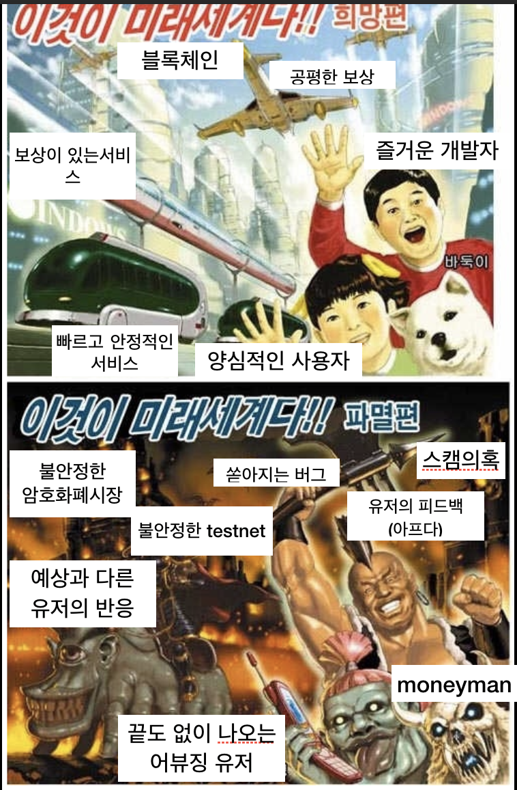

개인적인 6월 말 부터 개발 한 COSMEE PILOT(이하 코스미) 개발에 대한 회고를 작성하도록하겠습니다.

코스미를 개발하기 전까지는 HuiSeoul(이하 후이서울)을 개발하고있었습니다. 후이 서울을 개발할 때에는 개발적으로는 재미있었지만 Product를 사용하는 사용자의 이야기를 듣기 힘들다는 점이 개인적으로 힘들었습니다. 개발은 하고 있지만 Product를 만든다는 느낌이 적었습니다. 그러던 도중에 Front와 기획의 인원들이 코스미( ~~생각해보니 그때 에는 코스미라는 이름이 없었네요~~ ) 개발/기획을 위해 넘어간 상태였습니다. 다른 팀원이 떠나고 나서 새로운 Product에 대한 궁금증 (~~약간의 신비주의)~~ 로 관심이 가던 중 6월 말에 코스미 개발에 합류하게 됩니다.

첫 Master Branch Merge

기존에 완성된 Product가 아니라 새로 시작한 프로젝트를 보니 굉장히 신기하고 빨리 개발해 보고 싶은 생각이 들었습니다. 개발을 진행하면서 많은 사건 사고들이 생기고 많은 것을 배우고 팀에 떠난 팀원들도 있고 새로 합류한 동료 들도 생겼습니다. 코스미를 개발하면서 CosmoChain 의 팀원으로서 또 BackEnd 개발자로서 마지막으로 개인으로서도 많은 감상과 성장을 이루어 낸 것 같습니다.

이렇게 얻어 낸 감상과 성장을 흘려보내기에는 아쉬워서 COSMEE PILOT 종료 기념(?) 으로 두서없이 정리해 볼려고 합니다.

## 팀원으로서

- 새로운 Product, 새로운 사용자, 새로운 BM

  - 처음 코스미를 개발을 할 때 제일 좋았던 점이 대중이 사용자로서 사용하는 제품을 만든다는 점이었습니다. 저의 친구 저의 가족 심지어 저 조차 사용하는 Product를 만든다는 점이 저를 설레게 하였습니다. 그리고 새로운 BM 또한 흥미로운 구조라 즐거운 마음으로 Product를 개발할 수 있었습니다.

  

  - 하지만 새로운 Product는 반복 작업과 시간의 압박을 불러왔고 새로운 사용자는 오픈 이후 마치 폭도처럼 변해 Product 를 공격하기 시작하였습니다. 또한 새로운 BM 은 이해하기 어려웠습니다. 매일 매일이 쌓인 이슈를 처리하는 일이었고 열심히 일해도 사람들은 불평불만을 계속해서 말할 뿐이었습니다.
  - 하지만 어느 정도 Product의 완성도가 높아지고 업무에 익숙해질수록 넓은 시야를 가질 수 있게 되었습니다. 압박은 매우 큰 스트레스로 다가왔습니다. 하지만 스트레스는 Product를 성장시키는 촉진제가 되었던 것 같습니다. ( ~~하지만 그만...~~ )

## Backend 개발자 로서

- 이전에 없던 새로운 구조
  - COSMEE 를 개발 하면서 처음으로 서버리스 및 마이크로서비스 구조를 개발하게 되었습니다. 처음 서버리스를 볼 때에는 굉장히 재미있고 흥미로운 구조여서 좀 더 deep하게 파고 싶다는 생각을 하였습니다. 처음에는 비교적 새로운 기술이라 Reference가 너무 부족하였습니다. 하지만 가면 갈수록 저만 혹은 저희 팀만 알고있고 우리가 만든 구조가 남들이 시도하지 않은 미개척지라는 것을 알게 될수록 설레고 재미있게 개발할 수 있었습니다.
- 지속적인 자기 비판
  - 개발에서 중요한 것 중 하나는 방향성이라고 생각합니다. 그리고 그 방향성은 많은 Reference 로 나온다고 생각합니다. 하지만 Reference가 적은 상황이라면 방향성을 잡기 어렵습니다. 저희가 처음으로 서버리스 및 마이크로서비스 구조를 시작할 때에는 마음에 드는 Reference를 찾기 어려웠습니다. 그래서 개발이 방향성을 잃은 것이 아닐까에 대해 계속 의심하고 단점을 찾고 보완하기 위해 노력하였습니다. 그로 인해 방향성을 잃지 않고 설계 및 개발을 할 수 있었던 원동력이 될 수 있었던 것 같습니다.

## 개인으로서

- 개발자로써의 성장 (not Programmer)
  - 저는 개인적으로 프로그래머라는 말 보다는 개발자라는 말을 더 좋아합니다. 저는 단순히 코드를 치고 기능을 만드는 것이 아니라 팀으로써 Product를 개발하는 것이 중요하다고 생각합니다. 이번 코스미를 개발하면서 처음으로 모든 팀이 모여서 코스미의 컨셉과 방향성에 대해 논의하고 토론하는 것이 매우 뜻깊었습니다. 다른 팀과 협업한다는 느낌이 좋았습니다.
  - 유저의 피드백도 들을 수 있어서 좋았습니다. 저희가 만든 기능 중 어떤 기능에 좋아하고 싫어하는지를 바로 알 수 있는 점이 굉장히 보람이 있었습니다. 유저의 피드백을 통해 다음 기능을 기획하고 기능을 개발하는 프로세스가 개인적으로 마음에 들었습니다.
- 좋은 팀과 팀원
  - 코스미를 개발하면서 Backend 팀과 정말 많이 논의 하고 토론하는 과정을 거친 것 같습니다. 기존에 Reference가 없는 상황이라 서로의 생각이 다른 경우가 매우 많았습니다. 저희는 그럴 때마다 회의하고 의견을 구하는 등 커뮤니케이션이 매우 좋았다고 생각합니다. 그것을 입증하듯 초반과 비교하면 의사소통의 구조가 매우 안정화 되었다는 느낌을 받습니다. 이러한 경험을 할 수 있었다는 점이 저한테는 굉장히 행운이었다고 생각하였습니다.
  - 하지만 좋은 팀에게는 규칙이 있어야 한다고 생각합니다. 규칙이 필요한 이유는 새로운 사람이 왔을
    때 그분이 기존의 팀과 어떻게 소통을 해야 하는 지 쉽게 알 수 있도록 기본적인 규칙을 새워나야 한다고 생각합니다. 현재 Backend팀은 코스미 개발은 처음부터 현재까지 3명이서 진행하고 있었습니다. 코스미를 개발하면서 불문율 처럼 생긴 규칙들이 몇 가지 있습니다. 그것을 문서화 하고 규칙화해서 새로운 사람이 오더라도 쉽게 적응할 수 있는 구조를 만드는 것도 중요하다고 생각하였습니다.
- 욕심

  - 저는 저희의 팀을 잘 표할 수 있는 것은 결국에 Product라고 생각합니다. 그러므로 저희의 Product에 저희의 생각과 목표가 노출되고 결국에는 당당하게 자랑(?)할 수 있는 모습이 되고 싶습니다.
  - 그로 인해 코스미를 개발하면서 항상 더 잘하고 싶다는 욕심이 생겼습니다. 이런 기능은 지금 구조가 아니라 다른 구조로 했어야 하는데 .. 이것은 이 기능 보다는 저 기능이 더 적합한 것 같은데 라는 생각을 많이 하게 된 것 같습니다. 그로 인해 팀원들에게 저의 생각을 좀 더 강하게 주장하게 해서 어찌 보면 고집을 부린 측면이 있는 것 같습니다. 그런 측면은 팀원에게 죄송한 마음뿐입니다. 이러한 측면은 이번 코스미에서 굉장히 아쉬운 측면으로 남아있는 것 같습니다.

  코스미 파일럿을 개발하면서 느낀점을 간단히(?) 정리해 보았습니다. 두서없고 거칠게 쓴 글이라 읽기 힘들 었을 것 같습니다. 다만 이러한 글을 쓴 이유는 제가 어떠한 생각을 가지고 있고 이번 프로젝트로 어떠한 점을 느꼈는지에 대한 글을 팀원들과 공유하면 좋겠다는 생각으로 시작하였습니다.

  모두들 코스미 개발에 최선을 다해주셔서 감사합니다. 저도 좋은 팀원들 과 재미있는 프로젝트를 해서 너무 좋았습니다. 앞으로도 재미있게 일했으면 좋을 것 같습니다
