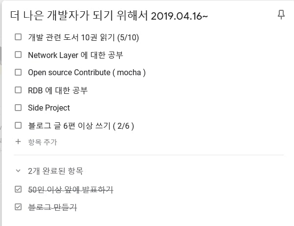
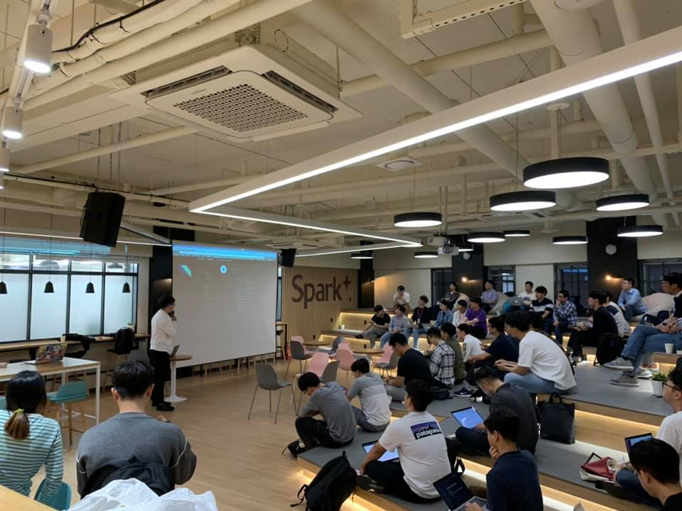

# Intro

2019년 10 월 1 일 스파크 플러스 선릉점에서 "Schema-First에서 Code-First로 Migration 하기" 라는 주제로 발표를 하였습니다.

개발을 시작할때 부터 밋업이나 컨퍼런스에서 발표하는 개발자들을 보고 나도 언젠가 연단에 있는 개발자같이 멋있게 발표할 수 있지 않을까 생각하였습니다.

1년차 개발자가 되었을때 2년차가 되고나서도 좋은 성장 곡선을 기르기 위해 해야할 것으로 공개된 장소에서 발표하는 것을 목표로 발표할 곳을 찾아보게 되었습니다.

# 발표하기 전

기존에 관심이 있고 많이 사용해보던 GraphQL에 대한 모임이 AWSKRUG (AWS Korea User Group)에 새로 생성되엇습니다.

GraphQL은 1년 넘게 Production에서도 사용하였고 주기적으로 새로운 소식을 확인하는등 약간의 자신이 있었기 때문에 해당 모임이 발표를 준비하기 좋은 기회라고 생각하였습니다.

AWSKRUG Graphql의 Organizer 님과도 기존에 2018년도 Amathon 에서 멘토로써 인연이 있었기에 발표의 기회를 잡게 되었습니다.

[AWSKRUG Meetup](https://www.meetup.com/ko-KR/awskrug/events/264940819/)

# 발표 준비

발표를 준비하면서 지금까지 제가 참가했던 MeetUp과 컨퍼런스에서 어떤 발표가 듣기 좋았는지 혹은 듣기 좋지 않았는지에 대해서 생각해 보게 되었습니다. 생각해보니 저가 생각했을때 좋은 발표들은 3가지 특징을 가지고 있었습니다.

1. 전달하고자 하는 주제의식이 명확해야 한다.

발표시 사람들은 생각보다 집중을 하지 않습니다. 또한 30분 ~ 1시간 정도의 시간동안 복잡하거나 다수의 주제를 청자에게 전달하기는 여간 쉬운일이 아닙니다.그래서 한 가지 주제를 가지고 어떤 문제를 해결해야하고 배경은 어떤지에 대한 설명이 충분해야 합니다. 

2. 발표는 지식을 전달하기 보단 Insight를 전달하는 행위다.

가끔 똑똑하고 능력있는 개발자가 발표에 실패하는 경우가 있는데 보통 내용이 너무 장대해서 기본 배경이 너무 많이 필요하거나 발표자가 길을 읽는 경우가 있다. 위 현상을 막기 위해서는 발표란 지식을 전달하기 보단 지식을 얻기위한 원동력을 주는 것이 좋습니다. 그래서 지식보다는 어떤 생각, 발상, 경로로 이러한 지식을 얻거나 어떤 Insight 를 얻었는지 공유하는 것이 더 좋을 수도 있습니다.

3. 적절한 유머와 쉬는 시간 그리고 완급조절이 필요하다.

전문으로 발표를 하는 사람이 아닌 경우 청자를 30분이나 한가지 주제에 집중시키기 쉽지 않습니다. 그래서 청자들에게 한 개의 발표를 마치 2~3개 정도의 강의인 느낌처럼 챕터를 나누고 챕터마다 짧게 정리를 하는 시간을 가져서 집중도를 유지 시켜야 합니다. 또한 유머는 시간 감각을 둔하게 만들어 주고 집중력을 끌어 올리는 힘이 있습니다. 그래서 유머는 꼭 필요하지만 너무 많은 유머는 발표의 주제 의식을 놓치게 만듬으로 적절한 선이 필요합니다. 

주제는 회사에서 제가 주도적으로 적용을 검토했던 내용을 주제로 하였습니다. 왜냐하면 좋은 주제지만 발표자가 잘 모르는 주제보단 발표자인 제가 직접 사용해 보고 고민해본 주제를 선정하는 것이 발표 준비에도 좋고 발표 이후 질문도 쉽게 답할 수 있기 때문입니다.

발표 준비는 1달 전 부터 시작하였습니다. 다행히도 그 당시 회사에서 비슷한 일을 Task로써 진행하고 있었기 때문에 발표 준비에 수월하였습니다.

# 발표 당일

첫 발표라서 당일에 매우 긴장을 하였습니다. 물론 긴장도 예상해서 미리 준비하기 위해 당일엔 반차를 사용하고 발표 장소 근처에서 발표 준비를 지속적으로 준비하였습니다. 2시간 정도 시간을 체크하고 발표 내용을 수정하면서 대본을 작성하였습니다. 혹시 말문이 막힐 경우를 대비해서 키워드 및 중요사항을 매 페이지 마다 작성하였습니다.(물론 너무 떨려서 읽지도 못했습니다.)

발표 장소도 제일 먼저 도착하여서 확인하였는데 .... 생각보다 너무 넓고 좋은 공간과 사방으로 앉을 수 있는 반원 모양의 연단을 보고 약간 (상당히 많이) 긴장하게 되었습니다. 

# 발표

[발표 자료](https://docs.google.com/presentation/d/1XQWrYrz8wr8DzXV4e8Ffhhb9pjrAu8BXq2xrNdE1pW4/edit?usp=sharing)

발표는 사실 크게 기억나지 않습니다. 너무 긴장해서 어떻게 말했는지 모를 정도로 머리가 하얗게 되었기 때문입니다. 

심지어 기억나지 않았을때를 대비해서 적어논 대본도 읽지 못 할 정도로 긴장하였습니다.

다만 이야기 하고자 하는 바를 다 이야기 한것 같아서 후련하였습니다.

# 발표가 끝나고 나서

끝나고 나서는 에멘탈의 한승오님께서 "TypeScript를 200% 활용한 GraphQL 서비스 개발" 이라는 주제로 발표해주셨습니다.

좋았던 점이 제가 발표한 주제와 일치하는데다가 저의 발표의 경우에는 원론적이고 이런적인 면이 많아서 실무적인 내용이 부족하였는데

한승오님께서 발표하신 주제는 실무적인 내용을 잘 설명해 주셨기 때문에 전체적으로 완성도가 높은 발표가 되었던것 같습니다.

# 후기
많은 사람 앞에서 발표한다는 것이 얼마나 부담되고 걱정되는 일인지 알게 되었습니다. 하지만  발표를 준비하면서 저도 많이 공부하고 실제로 제가 어떤 지식이 부족한 지를 알게 되는 계기가 되었던것 같습니다. 

힘든일이었지만 보람도 있고 재미있어서 앞으로 기회가 된다면 다시 발표를 하는 것도 좋을 것 같습니다.

