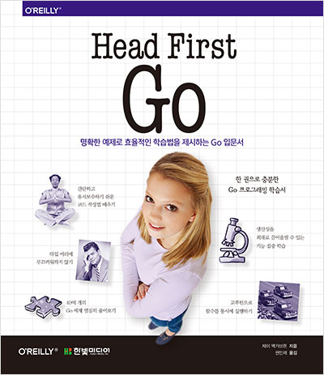

이런 말을 하기 그렇지만 개인적으로 Go 언어에 대한 철학을 좋아한다.

Strict 한 언어 규칙, 개발을 서포트 해주는 회가 있고 합리적인 철학을 가지고 있는 개발 언어가 좋은 언어라고 생각한다. 

Format까지 내장으로 만들고 변수 이름까지 강제적으로 규칙으로 제한하는 Strict 한 언어 규칙과 

Google 이라는 매우 강한 Background 를 가지고 있기 때문에 호시탐탐 Go 언어를 배우고자 시도하였다.

하지만 집에 Go 언어 책만 4권이 있고 Go 언어를 배우는 시도를 셀 수 없을 정도로 많이 시도하였다.

( ~쌓여만 가는 Go Tutorial~ ) 

[쌓여만 가는 Go Tutorial](./SIDE_PROJECT.jpeg)

본 리뷰는 `한빛 미디어 나는 리뷰어다` 의 지원으로 작성되었습니다.
