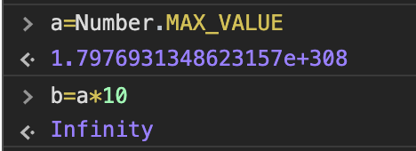

# Intro

자바스크립트에서 number 를 사용하는 것은 매우 익숙합니다. Javascript 개발자라면 하루에도 수십번, 아니 수백번씩 자연스럽게 number 연산을 사용할 것 입니다.
하지만 과연 number 연산의 내부에서는 어떻게 동작을 하고 제한 사항은 무엇이며 어떻게 하면 피할 수 있는지 알아봅시다.

# Javascript 에서 Number

자바스크립트는 일부 다른 언어와 다르게 한가지 number 타입을 사용합니다. 혹자는 이것이 자바스크립트의 단점 혹은 한계라고 이야기합니다. 하지만 언어의 단순함 혹은 간편함은 매우 중요한 요소이며 자바스크립트는 이것을 높게 생각했다고 생각합니다.

[MDN의 공식 문서](https://developer.mozilla.org/ko/docs/Web/JavaScript/Data_structures)를 보면 자바스크립트는 64비트 IEEE 754 기준에 따르는 타입 한개만 사용하고 있으며 -(2^53 -1) 와 2^53 -1 사이의 숫자값을 표현 할 수 있습니다. 또한 `Number`객체에는 몇가지 의미있는 값이 존재합니다. `Number.MAX_VALUE`, `Number.MIN_VALUE`, `Number.EPSILON` 입니다. 그리고 값은 아니지만 `Number.isSafeInteger` 가 있습니다. 각각에 대해서 간략하게 소개 하겠습니다.

# 특별한 Number

- Number.MAX_VALUE 와 Number.MIN_VALUE

위에서 언급했다시피 자바스크립트는 64비트 IEEE 754기준의 타입 한개만 따르고 있습니다. 그렇기 때문에 표현할 수 있는 값의 한계가 존재합니다. 실제로 Number.MAX_VALUE를 실행하면 1.7976931348623157e+308 라는 값을 확인할 수 있습니다. 만약 이 숫자를 넘어가는 값은 Infinity 로 표현 됩니다. 같은 방법으로 Number.MIN_VALUE보다 작은 값은 -Infinity로 표현됩니다.



- Number.MAX_SAFE_INTEGER 와 Number.MIN_SAFE_INTEGER

여기서 의문이 생길 수도 있습니다. 위에서 MAX_VALUE 는 알겠는데 MAX_SAFE_INTEGER 는 무엇이지? 라고 말입니다. [MDN의 공식문서](https://developer.mozilla.org/ko/docs/Web/JavaScript/Reference/Global_Objects/Number/MAX_SAFE_INTEGER) 에서 보면

> 이 값의 이유는 JavaScript가 IEEE 754에 기술된 배정밀도 부동소숫점 형식 숫자체계를 사용하기 때문으로, 이로 인해 -(253 - 1)과 253 - 1 사이의 수만 안전하게 표현할 수 있습니다. 여기서의 안전함이란 정수를 정확하고 올바르게 비교할 수 있음을 의미합니다.

즉 아래 그림의 경우가 발생할 수 있습니다.


그러므로 만약에 본인의 프로그램이 위 4가지 값에 근접하거나 그 이상의 단위를 사용해야 하는 경우가 있다면 필시 검사가 필요합니다.

- Number.isSafeInteger

하지만 이러한 검사를 자바스크립트에서 미리 지원해 줍니다.

```js
Number.isSafeInteger(3)
```

위와 같이 사용해 주시면 됩니다. 만약 직접 만드시고 싶으시다면

```js
Number.isSafeInteger =
  Number.isSafeInteger ||
  function(value) {
    return Number.isInteger(value) && Math.abs(value) <= Number.MAX_SAFE_INTEGER
  }
```

위와 같이 사용하실수 있습니다.

- Number.EPSILON

> Number.EPSILON는 Javascript가 식별할 수 있는 가장 작은 값입니다. 값은 2^-52 입니다. EPSILON보다 작은 수를 더해도 같은 수가 나옵니다.

# Outro

간단하게 Javascript 의 스팩중 Number를 매우 간략하게 살펴보았습니다. 이 글을 정리하면서 Javascript의 기초에 대해 좀 더 알게되는 계기가 되었씁니다.

**본 글은 인사이트 사의 '자바스크립트는 왜 그 모양일까?' 를 요약 및 정리 한 글입니다.**
