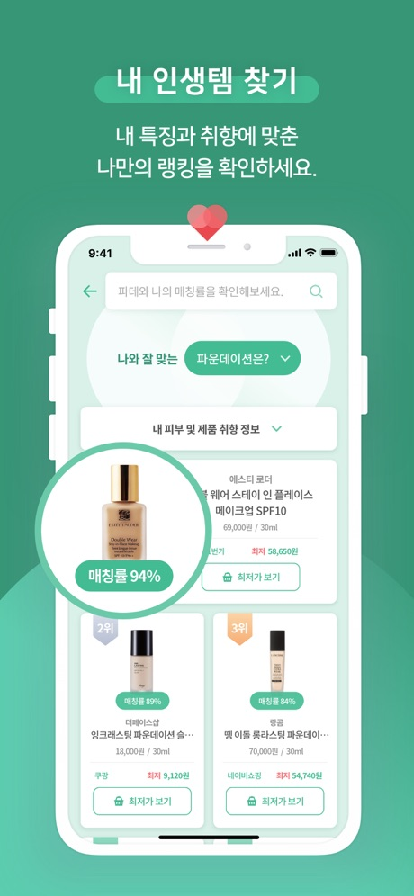
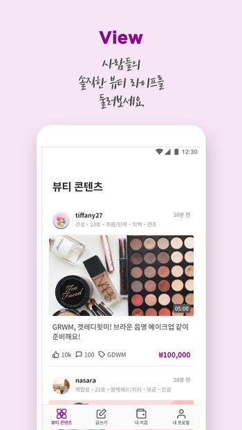
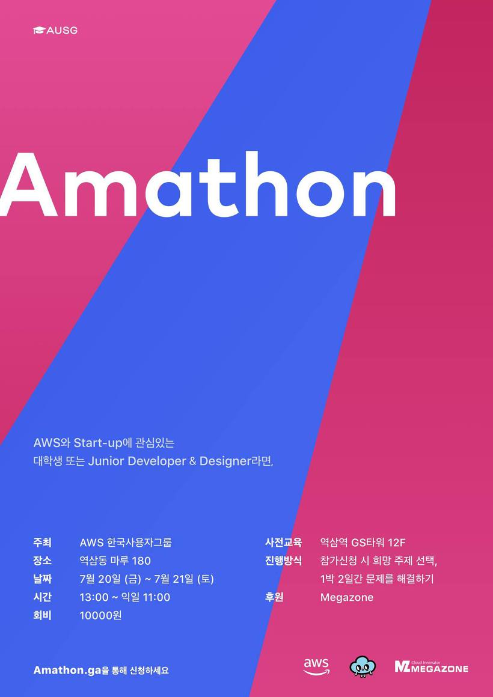

# Hong Jin ho

## 배움의 속도가 빠른 개발자

**Key Expertise**

- Typescript + Node.js 사용 경험
- GraphQL을 활용한 서비스 운영 경험
- Terraform 을 이용한 Devops 환경과 IAC 환경 구축
- NoSql 설계 및 운영 경험
- AWS Kinesis + Glue + Athena 를 이용한 DataLake 구축

---

# Summary

백엔드 개발자로 Node.js 와 Typescript, Graphql, DynamoDB 에 대한 경험이 있습니다. 또한 Serverless Architecture를 이용한 프로덕션 서비스를 개발한 경험이 있습니다. 다양한 기술을 접하며 기술에 대한 이야기를 나누는 것을 좋아합니다. 다양한 Meetup과 세미나에 자주 참가 하며 2019년 10월 1일 Graphql 모임에서 발표를 하였습니다. 단순히 코드를 쓰는 개발자 보다는 비즈니스를 생각하며 사용자에게 어떠한 가치를 전달할 수 있을지 고민하는 개발자를 꿈꾸고 있습니다.

# Keyword

**성장**

의식적인 성장을 하지 않으면 진정한 성장이 없다고 생각해서 의식적인 성장/도전을 위해 개발 환경과 팀 문화에 대해 관심이 많습니다. 더 좋은 개발자가 되기 위해 노력합니다.

**커뮤니케이션 / 협업**

서비스를 만드는 것은 개인이 아닌 팀으로 움직이는 것을 알고 중요하게 생각하며 팀의 색깔이나 방향성에 대해서 고민하고 더 좋은 문화를 만들기 위해 노력합니다.

**Devops**

Terraform과 IAC를 주도적으로 팀 개발 문화에 녹여낸 경험이 있으며 기존 Infra Architecture 개선하고 최적의 Infra Structure를 끊임없이 고민합니다.

**Business Domain Development**

개발이란 비지니스의 가치로 인해 빛을 보는 것이라는 것을 인지 하고 있습니다. 비지니스에 관심이 많으며 사용자들에게 어떻게 서비스의 가치를 전해 줄 수 있는 지 고민하고 비지니스와 개발 간의 간극을 줄이기 위해 노력합니다.

---

# Project

2019.03 ~ 2020.01

**FITSME**

[https://fitsme.kr](https://fitsme.kr/)

FITSME 는 "나만을 위한 화장품 추천 서비스"라는 주제로 화장품 및 리뷰를 분석하여 사용자에게 맞는 화장품을 추천 및 구매 하는 플랫폼입니다.

- 분산되어 있는 Repository를 MonoRepo 형식으로 개선하여 15개의 Repo를 6개로 줄여 개발 환경 개선에 주도적으로 참여
- AWS Personalize를 이용한 개인화 추천 시스템을 주도적으로 설계 및 개발하여 15%의 사용자 만족도를 증가
- 기존의 Schema First 구조의 GraphQL 을 Code First의 구조로 Migration작업을 주도적으로 진행
- RDB사용을 위한 Prisma 서비스를 Middleware 로 하는 Architecture 설계
- EventBus 를 활용하여 Event message 기반의 Architecture 를 구성
- 기존 AWS ElasticSearch 에서 ElasticCloud 로 Migration 작업을 진행
- Crawler 및 외부 API 를 통해 5만여개의 뷰티 데이터 확보 및 관리

---

2018.07 ~ 2019.03

COSME

[http://bit.ly/32t8Rzu](http://bit.ly/32t8Rzu)

COSMEE는 "보상이 있는 뷰티 SNS"라는 타이틀로 사용자들의 활동을 측정하여 암호화 폐(COSM)으로 보상을 받을 수 있는 플랫폼입니다.

- Terraform을 이용한 IAC 환경을 주도적으로 구축
- Lambda@edge 와 MediaConvert를 이용한 미디어 리소스 최적화를 위한 Architecture 설계 및 작업을 주도적으로 구축
- 빠른 개발과 기능 확장을 위한 Serverless Architecture 구축
- Kinesis와 Athena를 이용한 Data Lake 구축
- 블록체인 앱 모범 사례로 인정받아 삼성 갤럭시S10에 D-App으로 탑재

---

2018.04~ 2018.07

HuiSeoul

[https://apple.co/2n1Q9ir](https://apple.co/2n1Q9ir)

HuiSeoul은 채팅 기반의 중국 뷰티 역직구 앱서비스입니다.

- AWS China Region 운영 경험
- 중국주요배송사(YTO,STO,ZTO)의 배송 요청 자동화 설계에 참여
- SQS 를 통한 Message기반의 Architecture 구축에 참여

---

# 경력

2020.01 ~ Present

**Knowre**

US Product / Server Engineer

2018.04 ~ 2020.1

**트릴리어네어 , 블랜디드**

플랫폼팀 / Manager, Backend Engineer

---

# 학력

2013 ~ 2018

**동서울대학교**

컴퓨터 소프트웨어학과

4.0 / 4.5

---

## 자격증

2020.03 ~ 2023.03

**AWS Certified Solutions Architect - Associate**

[Link](https://www.certmetrics.com/amazon/public/badge.aspx?i=1&t=c&d=2020-03-20&ci=AWS00553092)

The AWS Certified Solutions Architect – Associate exam is intended for individuals with experience designing distributed applications and systems on the AWS platform.

2019.12 ~ 2022.12

**AWS Certified Cloud Practitioner**

[Link](https://www.certmetrics.com/amazon/public/badge.aspx?i=9&t=c&d=2019-12-31&ci=AWS00553092)

The AWS Cloud Practitioner exam enables individuals with an overall understanding of the AWS Cloud to validate their knowledge with an industry-recognized credential. It provides individuals in a larger variety of cloud and technology roles with a way to validate their AWS Cloud knowledge and enhance their professional credibility.

---

# 활동

### 2018년 8월 13일 AWS Blog 에 Article 기고

Lambda@edge를 이용하여 On-demand Image Resizing을 어떻게 구현 하는지 초보자들도 쉽게 이해할 수 있도록 작성하였습니다.

관련 Article : [Medium](https://engineering.huiseoul.com/lambda-%ED%95%9C%EA%B0%9C%EB%A1%9C-%EB%A7%8C%EB%93%9C%EB%8A%94-on-demand-image-resizing-d48167cc1c31?source=---------4------------------)

[AWS 주간 소식 모음 - 2018년 8월 13일 | Amazon Web Services](https://aws.amazon.com/ko/blogs/korea/week-in-review-13-8-18/)

### 2018년 7월 AWS Amathon 2018 Amathon prize

다수의 Lambda 로 동작하는 GraphQL 기반의 마이크로서비스 아키텍쳐 API
FrameWork 만들기라는 주제로 진행하여 Amathon prize 를 수상하였습니다.

관련 자료 : [https://github.com/cloudinertia/amathon2018-graphql-lambda](https://github.com/cloudinertia/amathon2018-graphql-lambda)

### 2019년 10월 AWSKUG GraphQL 발표

AWS 한국 사용자 그룹 중 GraphQL 모임
에서 “Schema-First에서 Code-First로
Migration 하기” 라는 주제로 발표하였습
니다.

발표 자료 : [http://bit.ly/30TvtYb](http://bit.ly/30TvtYb)

---

# Contact

Email [jinho.hong.recruiting@](mailto:inho.hong.recruiting@gmail.com)[gmail](mailto:jinho.hong.recruiting@gmail.com)[.com](mailto:inho.hong.recruiting@gmail.com)

Github [@jinhokong](https://github.com/jinhokong)

Linkedin [www.linkedin.com/in/jinho-hong](http://www.linkedin.com/in/jinho-hong)

Medium [@jinhohong](https://medium.com/@jinhohong)

Blog [jinho.dev](http://jinho.dev)

## Thanks for reading! 👋
